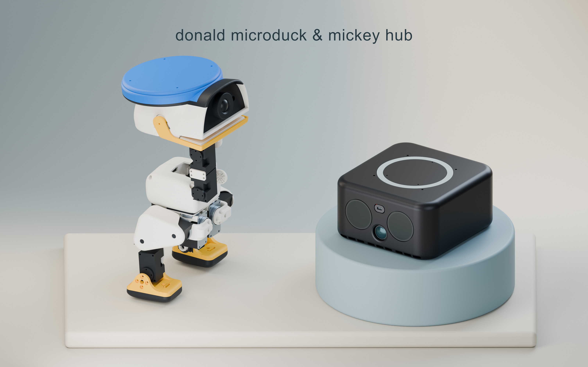

# Reactor product portrait

[Open the 3200 × 2000 JPEG](reactor-family.jpg)

A studio portrait with a warm pearl and dusty-blue backdrop,
matte ceramic staging, broad softbox lighting and contact shadows. Donald
Microduck uses Classic Sailor Blue; Mickey Hub retains its graphite finish.

The portrait uses the product geometry at its physical scale. An 8-degree jaw
opening and camera angle keep the neck bearing out of the mouth view; no
mechanical part was removed from the source assembly.

The separate portrait Blender scene and rendering tools are stored in the
local `memory_backups/3d_sources/assets/` archive. Each project includes its
own final integrated Blender model and STL parts.

The original 5120 × 3200 PNG is preserved in the ignored local
`memory_backups/` archive. The repository includes one compressed JPEG for
viewing and README display.

## Project previews

- [Donald Microduck](../donald-microduck/media/): rotating decomposition and assembled turntable GIFs.
- [Mickey Hub](../mickeyhub/media/): a rotating decomposition GIF with English module descriptions.

GIFs and the portrait are included directly in the repository. Full MP4 renders
remain under the local `memory_backups/videos/` directory and are excluded from
commits and source archives.
