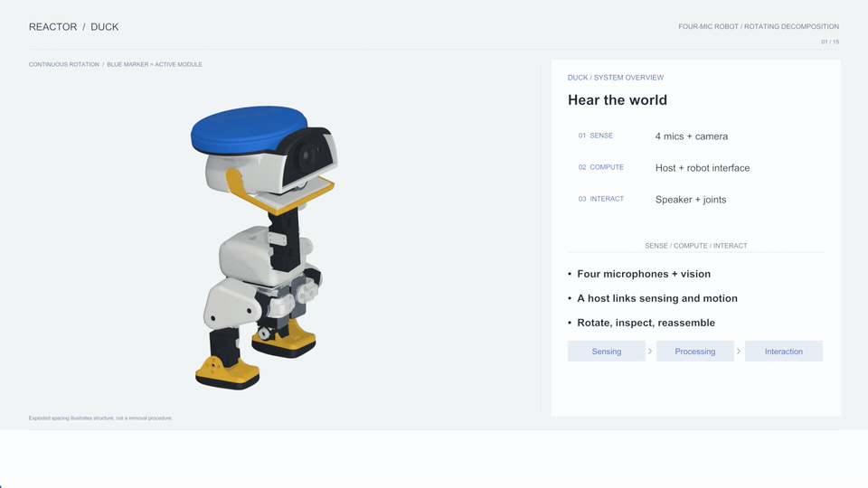
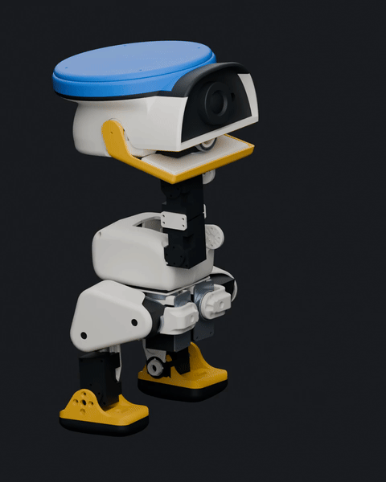

# Donald Microduck

**Give listening a body.**

[Reactor](../) · [Design files](mechanical/) · [Firmware](firmware/) · [Host tools](software/)

A voice can come from anywhere in a room. Donald Microduck explores how a small
robot can listen, look toward a person and respond through sound and movement.
It combines a Microduck-based body with four-microphone ReSpeaker hardware,
a camera, a Radxa ZERO 3W Linux host, a speaker and 15 smart servos.

## Watch it come apart



The model keeps rotating while its lid, shell, microphone board, controllers,
camera, speaker, battery, servos and frame separate into labeled modules.
This 45-second silent preview includes English explanations and close-ups.
The GIFs, captions and narration are included in [Media](media/).

## What is inside

| System | Role |
| --- | --- |
| Four-microphone ReSpeaker hardware | Audio input for experiments with listening and voice interaction. |
| Radxa ZERO 3W + XIAO ESP32-S3 | Linux host, USB audio bridge and device control. |
| Camera + motion sensing | Visual input and orientation information. |
| Speaker | Audio feedback and voice output. |
| 15 smart servos | Head, beak and body movement for expressive interaction. |
| Custom enclosure | A head and lid around the robot's audio and electronics assembly. |

The current firmware exposes **16 kHz stereo processed audio** from the
four-microphone hardware. Independent raw channels, sound-source localization
and autonomous behavior remain development work.

## Open the design

| I want to… | Start here |
| --- | --- |
| Inspect the complete robot | [Assembled Blender model](mechanical/duck.blend) |
| Inspect the head and lid | Separate objects in the final assembled Blender model |
| Print and assemble the parts | [Mechanical guide](mechanical/) — 37 printable STL parts |
| Build the USB audio firmware | [Firmware guide](firmware/) |
| Explore audio and device controls | [Host tools](software/) — audio scope, controls and voice-activity events |
| Work without the robot | [Simulation examples](sim/) |
| View the rotating explainer | [Media guide](media/) — GIFs, captions and narration |

Large models use Git LFS. From your checkout:

```sh
git lfs install --local
git lfs pull
```

Open `mechanical/duck.blend` in Blender for the complete assembly. It is the
project's only included Blender file. The [mechanical guide](mechanical/)
describes the STL parts and simulation meshes. Separate head/lid projects,
STEP references, construction baselines and animation scenes are archived locally.

## Classic Sailor Blue

<p align="center">
  
</p>

The selected appearance uses a blue cap and outer rim, a black front band,
a warm white body, yellow beak and feet, and an open-mouth presentation pose.
The [palette files](media/palettes/) record the presentation colors.

## Development status

The supplied files cover mechanical design, audio firmware, host tools and
simulation. Physical balance, print fit, assembly clearances and acoustic
performance still require testing on the assembled robot. Exploded spacing
illustrates the structure; the presentation pose is not a validated motion sequence.

GIF previews are included in this repository. Full MP4 renders are stored
locally under `memory_backups/videos/donald-microduck/` at the repository root
and excluded from commits. The corresponding rendering scenes and tools are
also archived; the [media guide](media/) describes the included previews.

## License and upstream

Software retains the official upstream [Apache-2.0 license](LICENSE).
Microduck-derived models retain the upstream noncommercial, share-alike notice.
See [UPSTREAM_LICENSES.md](UPSTREAM_LICENSES.md) for the preserved terms and
[Reactor's third-party record](../THIRD_PARTY.md) for source attribution.
