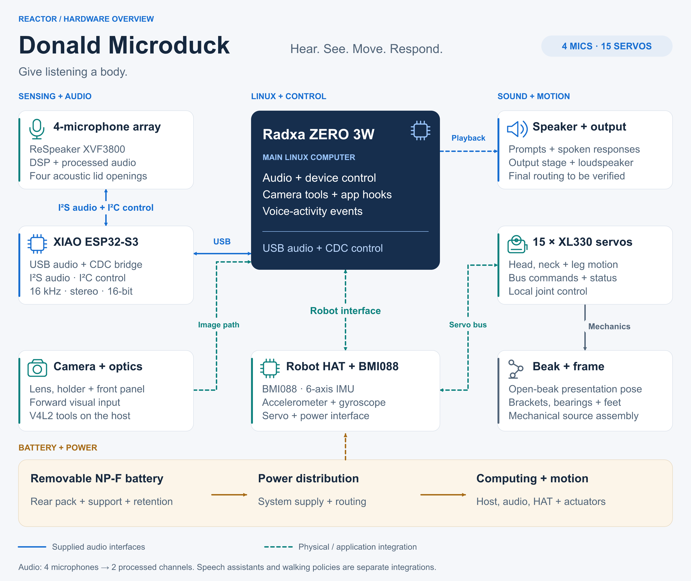

# Donald Microduck hardware overview

[Large PNG](images/hardware-overview.png) ·
[Editable SVG](images/hardware-overview.svg) ·
[Assembled Blender model](../mechanical/duck.blend)

The figure maps the functions of the current robot assembly and the supplied
audio firmware. It is a functional overview, not a connector or wiring guide.

## How the hardware works together

| Function | Hardware and connection |
| --- | --- |
| Hear | Four acoustic lid openings align with the ReSpeaker XVF3800 microphone array. The XVF3800 DSP supplies processed audio to the XIAO bridge. |
| Bridge audio and controls | XIAO ESP32-S3 connects to XVF3800 over I²S for audio and I²C for controls. The Radxa USB host connects to the **XIAO USB port** for UAC2 audio and CDC commands/events. |
| Run applications | Radxa ZERO 3W runs the supplied audio scope, device-control daemon and application hooks. Voice activity is an audio/firmware event, not keyword recognition. |
| See | The camera lens, holder and front panel provide the optical assembly. Host tools inspect the Linux V4L2 camera stack and support snapshots. The figure does not assume a particular image sensor or connector. |
| Sense body motion | The Robot HAT includes a BMI088 accelerometer and gyroscope for six-axis motion sensing. The IMU is part of the board, rather than a separately modeled module. |
| Move | The assembly record identifies 15 DYNAMIXEL XL330 smart servos for head, neck and leg movement. The Robot HAT provides the robot interface; motion-control software is a separate integration. |
| Speak | Playback travels from the host through USB and the XIAO I²S bridge. The final output circuit and speaker connection must follow verified physical wiring. The dashed playback line shows this overall function. |
| Express and support | The beak, brackets, bearings, torso, legs and feet form the mechanical assembly. The open beak is a presentation pose, not a validated actuation or walking sequence. |
| Supply power | A removable rear NP-F battery envelope, its supports and the power circuitry supply computing and motion. Capacity, rail ratings and runtime are not inferred from the model. |

## Reading the figure

Blue solid lines identify the supplied audio interfaces. Dashed lines show
physical or application integration paths; they do not claim completed
hardware validation. The gray connection represents a mechanical relationship.

The four microphone inputs currently become **two processed USB channels at
16 kHz, signed 16-bit stereo**. Independent raw microphone channels,
hardware-calibrated source localization, speech-assistant services and walking
policies remain separate development work.

The retained MuJoCo example predates the final enclosure and lists 14
actuators. It is not a complete controller for the 15-servo assembly described
by the module record. See the [simulation scope](../sim/) and
[mechanical guide](../mechanical/) for those source boundaries.

## Figure sources

- [Module decomposition record](../media/decompose.json): assembly roles,
  Robot HAT / BMI088, XL330 servos, optics, speaker and battery descriptions.
- [Firmware guide](../firmware/) and [bridge implementation](../firmware/main/main.c):
  USB, I²S and I²C interfaces.
- [USB descriptors](../firmware/main/usb_descriptors.c): capture and playback
  channels and CDC control.
- [Host tools](../software/) and [camera/audio scope](../software/micscope.py):
  Linux application and camera functions.
- [MuJoCo source](../mechanical/mjcf/robot_walk.xml) and
  [final Blender assembly](../mechanical/duck.blend): mechanical references.
