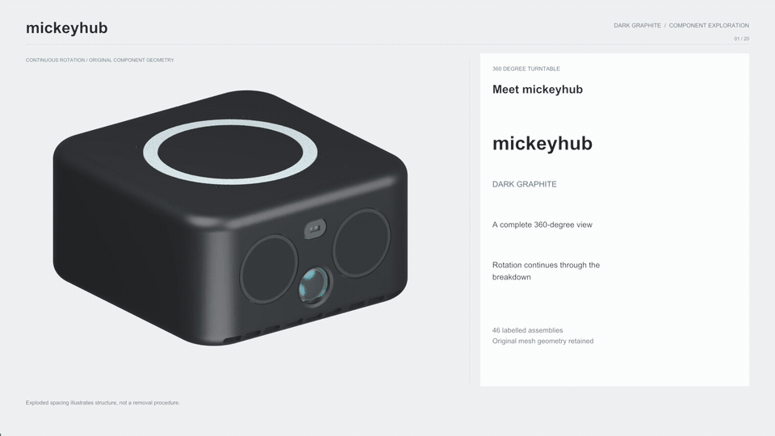
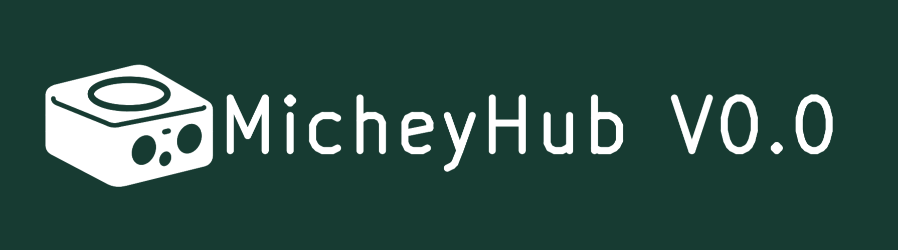

# Mickey Hub

**Bring perception together.**

[Reactor](../) · [Design files](mechanical/) · [Electronics](electronics/) · [Firmware](firmware/)

Mickey Hub explores how a compact device can notice activity around it and
respond through a familiar face, light and sound. It shares Donald Microduck's
Radxa ZERO 3W host and four-microphone audio platform, with more sensors and I/O
inside a rounded graphite enclosure.

## Explore every module



The animation keeps rotating as **20 chapters introduce 46 labeled assemblies**,
from sensing and computation to power, wiring and the enclosure. This silent
GIF plays the full sequence at twice its original speed, with English labels
and detail views. [Captions](media/mickeyhub-animation.srt),
[the storyboard](media/mickeyhub-animation.json) and the
[media guide](media/) are included.

## A compact sensing platform

| System | Hardware and intended role |
| --- | --- |
| Hearing | Four-microphone ReSpeaker array and speaker for listening and audio feedback. |
| Surrounding activity | Three millimeter-wave radar modules facing left, right and rear. |
| Vision and depth | Ultra-wide front camera and an 8 × 8 ToF depth-sensing module. |
| Motion and heading | Six-axis IMU and compass for orientation and mobile-support experiments. |
| Interaction | Glasses-like dual displays, light ring, speaker and physical controls. |
| Computation and expansion | Radxa ZERO 3W host, RP/S3 controllers, carrier board and additional interfaces. |

These inputs provide a platform for perception experiments. Complete sensor
fusion and reliable autonomous responses remain development goals.

## Open the design

| I want to… | Start here |
| --- | --- |
| Inspect the complete device | [Assembled Blender model](mickeyhub.blend) |
| View the rotating explainer | [Media guide](media/) — GIF, storyboard and captions |
| Work on the enclosure | [Mechanical guide](mechanical/) — 15 print STLs and four fit samples |
| Inspect individual assemblies | [Component catalog](components/) — 46 descriptions, dimensions and source-object names |
| Edit the circuit and PCB | [Electronics guide](electronics/) — KiCad projects, local libraries, schematic PDF and BOM |
| Review the fabrication outputs | [Manufacturing guide](manufacturing/) — Gerbers, drills, placement and reference views |
| Build device software | [Firmware guide](firmware/) — RP, S3 and Linux sources |
| Explore the circuit checks | [Simulation guide](simulation/) — 18 executed MUX DC cases |
| Rebuild or review current constraints | [Build instructions](docs/BUILD.md) · [Engineering status](docs/CURRENT_STATUS.md) |

Large models use Git LFS. From your checkout:

```sh
git lfs install --local
git lfs pull
```

Open `mickeyhub.blend` in Blender for the complete assembly. It is the project's
only included Blender file. Printable geometry is supplied as STL.
Component GLBs, STEP references, structural construction baselines and separate
animation projects are retained in the local archive.

## The board identity



The carrier uses a monochrome icon traced from the enclosure and the marking
**MicheyHub V0.0**. [Editable SVG](electronics/branding/mickeyhub-mark.svg),
native PCB graphics and current Gerbers are included. The electrical design
retains its **BOX R2.1R** revision.

## Development status

The carrier and both adapter projects pass the recorded native DRC/ERC checks.
Print exports have recorded geometry checks, and the simulation guide describes
the executed DC cases. Complete powered-device qualification remains open.

Power-actuator selection, fan/ToF electrical compatibility and harness fit need
further work. Read [CURRENT_STATUS.md](docs/CURRENT_STATUS.md) and the
[current electrical contract](docs/current_contract/) before assembling hardware.

From this project directory, verify the committed assets with:

```sh
python3 tools/verify_release.py
```

The check uses the included GIF, models and design evidence. Full MP4 renders
stay locally under `memory_backups/videos/mickeyhub/` at the repository root;
they are excluded from commits and are not required to verify a fresh checkout.
[Build instructions](docs/BUILD.md) describe the supplied files and checks.

## License

Mickey Hub's first-party work is available for **noncommercial use**:

- Designs, models, documentation and media: **CC BY-NC 4.0**.
- Firmware and software tools: **PolyForm Noncommercial 1.0.0**.

See [LICENSE](LICENSE) for the scope and complete texts, and
[THIRD_PARTY.md](THIRD_PARTY.md) for exclusions. Third-party code, documents and
CAD retain their own terms. Donald Microduck's upstream licenses remain separate.
