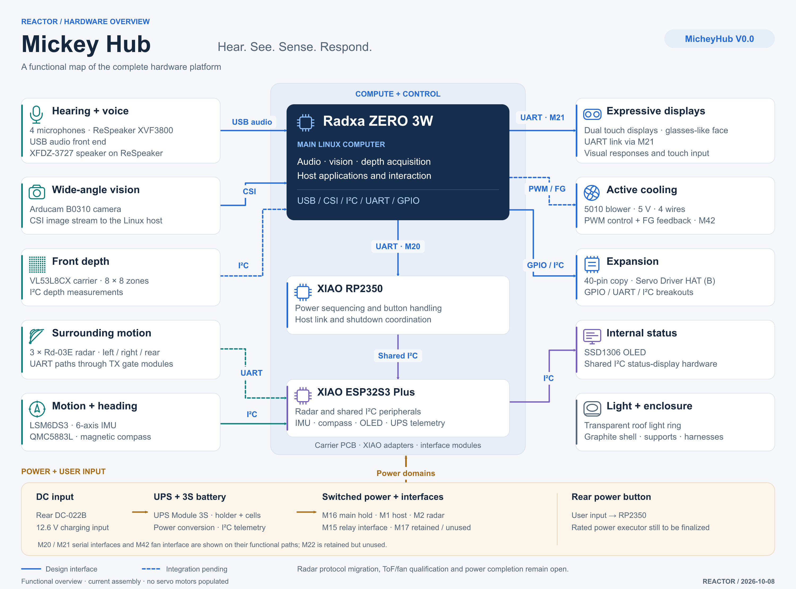

# Mickey Hub hardware overview

[Large PNG](images/hardware-overview.png) ·
[Editable SVG](images/hardware-overview.svg) ·
[PCB and assembled-electronics previews](../electronics/)

This figure maps the functions and interfaces of the current Mickey Hub
assembly. It is a system block diagram; connector pin assignments and detailed
electrical requirements belong to the
[current contract](current_contract/pin_and_power_contract.json).

## How the hardware works together

| Function | Hardware and connection |
| --- | --- |
| Hear and speak | The four-microphone ReSpeaker XVF3800 connects to the ZERO host over USB. The XFDZ-3727 speaker connects to ReSpeaker. |
| See | The Arducam B0310 camera uses the host's CSI interface. |
| Measure front depth | The VL53L8CX carrier provides 8 × 8 ranging zones through the candidate ZERO I²C route. |
| Sense activity around the box | Three Rd-03E radars face left, right and rear. Their UART paths use the S3 controller and the carrier's TX gate modules. |
| Measure motion and heading | The LSM6DS3 six-axis IMU and QMC5883L compass use the S3 shared I²C bus. |
| Run host applications | Radxa ZERO 3W handles Linux applications, audio, vision, depth and interaction. |
| Coordinate power | XIAO RP2350 handles the button and power-state logic. It exchanges host messages through M20 UART and controller messages over shared I²C with S3. |
| Coordinate peripherals | XIAO ESP32S3 Plus serves radar and I²C peripherals, including motion sensors, the internal OLED and UPS telemetry. |
| Interact | The dual touch displays connect through M21 UART. The SSD1306 is an internal I²C status display. The transparent roof ring is shown as an optical enclosure element. |
| Cool the host | The 5 V four-wire 5010 blower uses the M42 PWM path and FG feedback. |
| Expand | The full 40-pin copy, Servo Driver HAT (B) and GPIO/UART/I²C breakouts expose existing signals. No servo motors are populated. |
| Supply power | The rear DC-022B input feeds UPS Module 3S and its battery assembly. M16, M1 and M2 serve main hold, host and radar power, through the M15 control interface. |

The retained M17 relay and M22 serial interface are currently unused.
Breakouts expose shared signals; they do not add independent controller
peripherals.

## Reading the current design

Solid lines show design interfaces. Dashed lines identify the radar, ToF and fan
paths whose current module integration is still pending. They do not indicate
electrical isolation or a passed hardware test.

The assembly contains three Rd-03E radars, while the supplied firmware still
targets the older four-LD2450 configuration. Protocol migration remains open.
The ToF carrier and fan interfaces need electrical qualification, and a suitably
rated power executor and its final interlock remain to be completed.
See [engineering status](CURRENT_STATUS.md) and [firmware behavior](../firmware/).

## Figure sources

The diagram follows the current [component catalog](../components/catalog.json),
[wiring record](wiring/wiring_manifest.json),
[power and interface contract](current_contract/pin_and_power_contract.json)
and [firmware documentation](../firmware/README.md). Current assembly and
engineering notes take precedence over retained legacy labels.

PCB front/back previews are native KiCad renders. The populated carrier is
rendered from [mickeyhub.blend](../mickeyhub.blend), with board-mounted modules
kept in their original positions. The native designs and final model remain
the editable sources; the SVG above is the editable functional figure.
