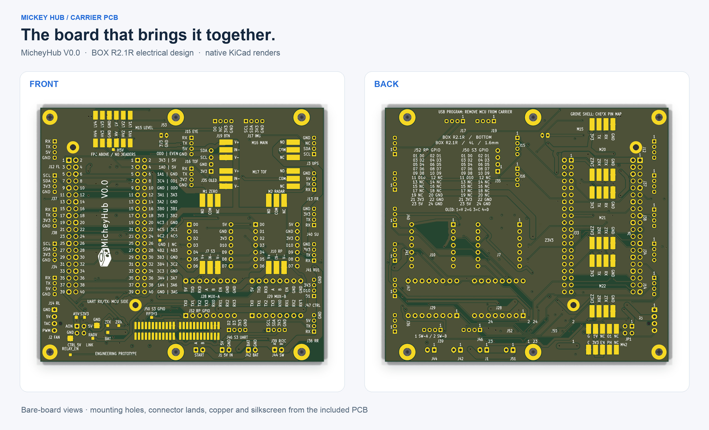
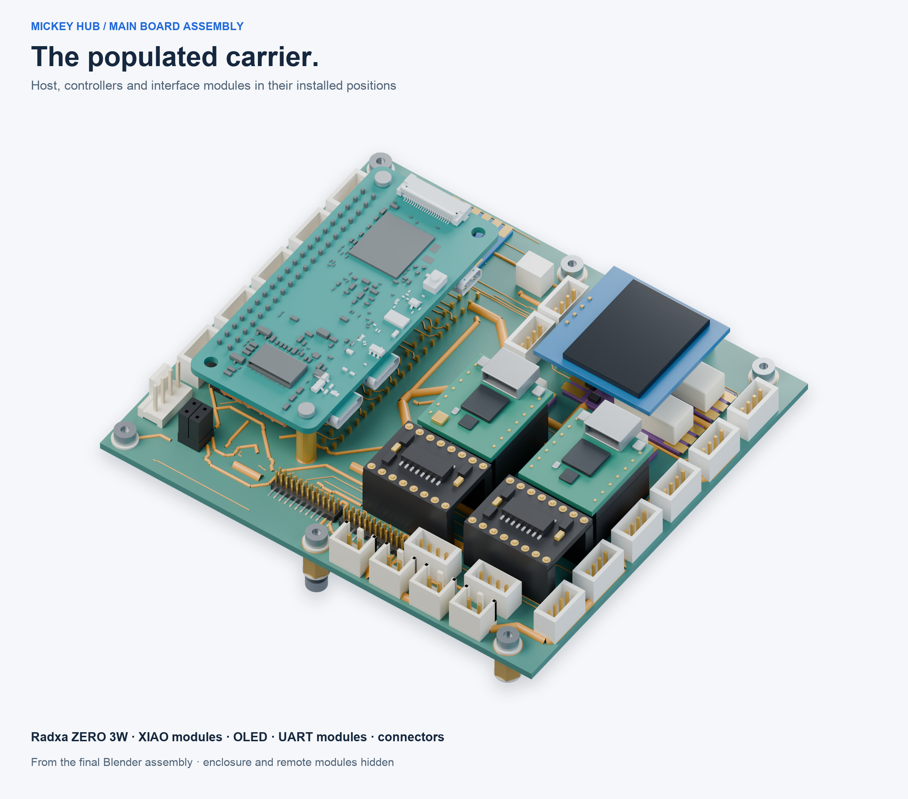

# Schematic, PCB and libraries

## Board previews

Front and back bare-board views come directly from
[the native carrier PCB](kicad/box_carrier_modules_r2.kicad_pcb), rendered in
KiCad. Click any preview to inspect the large image.

This populated view uses the mounted electronics from the final
[integrated Blender assembly](../mickeyhub.blend). Components retain their
source geometry, materials and placement; the enclosure and remote devices are
hidden. Purchased-module models include simplified reference geometry.

For the system-level relationships, see the
[hardware functional overview](../docs/HARDWARE_OVERVIEW.md).

## Editable sources and board identity

Open [kicad/box_carrier_modules_r2.kicad_pro](kicad/box_carrier_modules_r2.kicad_pro) in KiCad. The project retains its original electrical identifier, BOX R2.1R. The product is mickeyhub.

`kicad/` includes schematic sheets, the PCB, project settings, local symbols,
footprints and datasheets. The carrier has a monochrome icon traced from the
actual enclosure and the marking **MicheyHub V0.0**. The editable
[SVG icon](branding/mickeyhub-mark.svg) and native KiCad polygons are both included.

The preview is cropped from the native silkscreen export and rotated for reading.

[branding.json](branding.json) records the changed graphics and source hashes.
All other raw KiCad blocks match the archived source, including copper, nets,
pads, footprints, board outline and settings.
[library_relocation.json](library_relocation.json) records the earlier
project-relative JST 3D-model path change. STEP and VRML reference models are
now archived locally; their optional preview paths remain in the unchanged
PCB and footprint files. The release verifier checks board integrity and
manufacturing outputs without requiring those archived 3D previews.

[schematic.pdf](schematic.pdf) is the existing schematic publication. [bom/mickeyhub-board-bom.csv](bom/mickeyhub-board-bom.csv) was exported recursively from the included schematic. It is an engineering BOM, not a current stock/price or assembly-order quotation. Component/module selections and reference evidence are in [../components](../components/).

Native KiCad checks on the relocated copy are in `validation/`: DRC 0, ERC 0, unconnected items 0, schematic parity issues 0. These results address CAD rules and consistency, not unresolved system power and module compatibility. Read [../docs/CURRENT_STATUS.md](../docs/CURRENT_STATUS.md) before using the connection proposals.

Local footprint libraries retain the entries referenced by the delivered
schematics, PCBs, symbols and adapter records. Unused variants and intermediate
netlist/analysis exports are archived. `kicad/datasheets/` is the canonical
location for project datasheets, shared by the component documentation.

`daughterboards/` contains the editable RP and S3 adapter projects, each with its
own local symbol library. The adapters carry the same product/version marking.
Their native DRC and ERC results are recorded in
[validation/adapters.json](validation/adapters.json). Inspect the complete device
in [mickeyhub.blend](../mickeyhub.blend) and use the
[component catalog](../components/) for module descriptions.
